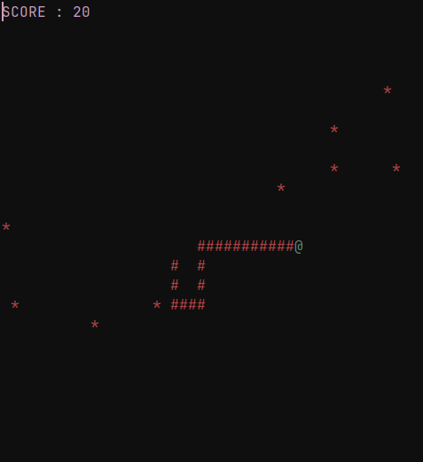

# jsnake

## Installation Script
bash:
```bash
git clone https://github.com/realdanvanth/jsnake.git && echo 'alias jsnake="java $(pwd)/jsnake/main.java"' >> ~/.bashrc 
```
zsh:
```zsh
git clone https://github.com/realdanvanth/jsnake.git && echo 'alias jsnake="java $(pwd)/jsnake/main.java"' >> ~/.zshrc
```

JSnake is a lightweight terminal-based Snake game for Linux, built with Java and utilizing ANSI escape codes for visuals. 

## Controls

- **W/A/S/D**: Move the snake
- **Q**: Quit the game

## Images

 
